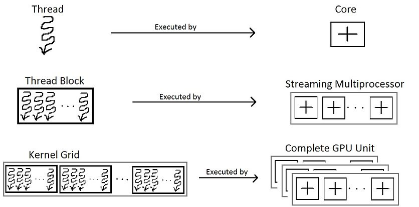
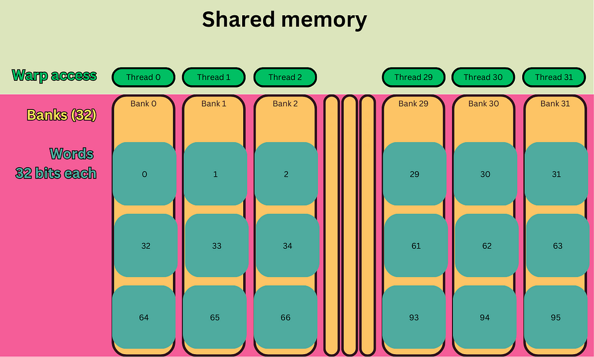
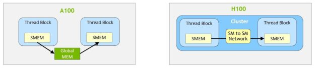

#### 项目概述
1. Objective Primary Goal: 

    Demonstrate how Shared Memory serves as a critical optimization tool in GPU programming, enabling high-performance computing by reducing latency and improving bandwidth utilization.

2. Focus Areas:
+ Core concepts and architectural role of Shared Memory.
+ Practical implementation in CUDA.
+ Performance optimization strategies and real-world applications.


#### 整体架构
**0. GPU vs CPU**
GPUs were originally designed to accelerate the rendering of 3D graphics. Over time, they became more flexible and programmable, enhancing their capabilities. This allowed graphics programmers to create more interesting visual effects and realistic scenes with advanced lighting and shadowing techniques. Other developers also began to tap the power of GPUs to dramatically accelerate additional workloads in high performance computing (HPC), deep learning, and more.
This difference in capabilities between the GPU and the CPU exists because they are designed with different goals in mind. While the CPU is designed to excel at executing a sequence of operations, called a thread, as fast as possible and can execute a few tens of these threads in parallel, the GPU is designed to excel at executing thousands of them in parallel (amortizing the slower single-thread performance to achieve greater throughput).


https://docs.nvidia.com/cuda/cuda-c-programming-guide/

**1. Hierarchy:**
    GPU Chip → GPC → TPC → SM → CUDA Cores/Tensor Cores  
```
GPU
├── GPC (Graphics Processing Cluster)
│     ├── TPC (Texture/Processor Cluster)
│     │      ├── SM (Streaming Multiprocessor)
│     │      │     ├── CUDA 核心 (CUDA Cores)
│     │      │     ├── 张量核心 (Tensor Cores)
│     │      │     ├── RT 核心 (Ray Tracing Cores)
│     │      │     └── 纹理单元 (Texture Units)
│     │      └── PolyMorph Engine负责几何阶段的计算，支持复杂的 3D 场景
│     └── Raster Engine (光栅引擎)
└── L2 Cache (共享缓存)
```
    
**2. GPC-TPC Workflow:**
+ GPC (Graphics Processing Cluster):
GPC is the top-level hardware module in a GPU, coordinating parallel workloads across submodules (e.g., TPCs, SMs).A GPC is a group of SMs in the hardware hierarchy that are always physically close together. 

+ TPC (Texture纹理 Processing Cluster):
TPC is a submodule of a GPC, originally designed for texture processing (critical for graphics rendering). Now contains SMs (Streaming Multiprocessors) and texture units, handles both texture operations and general-purpose compute tasks (e.g., CUDA workloads).

Task Distribution:GPU assigns rendering/compute tasks to GPCs.
GPC Scheduling:GPC splits tasks and delegates them to TPCs.
TPC Execution:SMs execute computations; (texture units process graphics textures.)
Result Aggregation:GPC consolidates outputs from TPCs for final output.

+ Raster Engine (光栅引擎)：渲染用

**3. SM Architecture:**
Streaming Multiprocessors (SMs) are the fundamental computational units in NVIDIA GPUs.
An SM is a parallel processing unit within an NVIDIA GPU that executes multiple threads concurrently. Each SM contains：
multiple CUDA cores (also called ALUs or Streaming Processors, each capable of executing one thread per clock cycle,), 
and fixed resources: 
+ Registers :Fast, private memory for thread-local variables.
+ Shared Memory(SMEM)
+ L1 Cache/Shared Memory Partition:Configurable split between L1 cache and shared memory (e.g., 128 KB total in Ada Lovelace).
+ Warp(线程束) Schedulers:Manage warp execution and context switching to hide latency.
+ LD/ST:load/store负责加载存储  --不重要

**4. CUDA Cores & sp:(not so important)**
+ Tensor Cores:
Tensor Cores are specialized high-performance compute cores for matrix multiply and accumulate (MMA) math operations that provide groundbreaking performance for AI and HPC applications. Tensor Cores operating in parallel across SMs in one NVIDIA GPU deliver massive increases in throughput and efficiency compared to standard floating-point (FP), integer (INT), and fused multiply-accumulate (FMA) operations.
+ Streaming processor(sp): 
The most basic processing unit. The GPU does parallel computing, that is, many SPs do processing at the same time. Now the term SP has been somewhat watered down, instead using thread instead. One SP corresponds to one thread.
+ SFU(special function unit):
专门处理复杂数学运算的硬件单元，支持的运算包括：
超越函数：sin, cos, exp, log, sqrt 等。
插值运算：如纹理采样中的插值。
类型转换：如浮点与整数的快速     --不重要 

**5. Conclusion:**

https://images.nvidia.com/aem-dam/Solutions/geforce/ada/nvidia-ada-gpu-architecture.pdf

The full AD102 GPU includes 12 Graphics Processing Clusters (GPCs), 72 Texture Processing 
Clusters (TPCs), 144 Streaming Multiprocessors (SMs), and a 384-bit memory interface with 12 
32bit memory controllers. 
The full AD102 GPU includes: 18432 CUDA Cores,144 RT Cores ,576 Tensor Cores ,576 Texture Units 


https://images.nvidia.com/aem-dam/Solutions/geforce/ada/nvidia-ada-gpu-architecture.pdf


https://images.nvidia.com/aem-dam/Solutions/geforce/ada/nvidia-ada-gpu-architecture.pdf

#### Shared Memory
**0. some basic concepts:**
+ Process: 
refers to an application running in memory, each process has an independent memory space, an application can run multiple processes at the same time; Process is also a process of execution of the program, is the basic unit of the system running program; The system running a program is the process of a process from creation, operation to extinction.
+ Thread: 
A thread is an execution unit in a process that is responsible for the execution of the program in the current process and the smallest execution unit in the operating system. There is at least one thread in a process. There can be multiple threads in a process, and this application can also be called a multithreaded program.Thread is , it is an independent execution path in the process. Threads can share the resources of a process, but each thread has its own program counter, stack, and register. The use of threads can improve the concurrency and execution efficiency of programs.

+ **Thread Block**
A thread block contains multiple threads that run concurrently on a single SM, where the threads can synchronize with fast barriers and exchange data using the SM’s shared memory.

+ Grid
A grid is composed of thread blocks in the legacy CUDA programming model as in A100.

https://developer.nvidia.com/blog/nvidia-hopper-architecture-in-depth/

+ indexing
As many parallel applications involve multidimensional data, it is convenient to organize thread blocks into 1D, 2D or 3D arrays of threads. The blocks in a grid must be able to be executed independently, as communication or cooperation between blocks in a grid is not possible. (Before Hopper)
Every thread in CUDA is associated with a particular index so that it can calculate and access memory locations in an array.The maximum x, y and z dimensions of a block are 1024, 1024 and 64(单个线程块在 x 维度上的最大大小是1024), and it should be allocated such that x × y × z ≤ 1024, which is the maximum number of threads per block.
Blocks can be organized into one, two or three-dimensional grids of up to 2^31-1, 65,535 and 65,535 blocks in the x, y and z dimensions respectively, without maximum limits on the number of blocks in the grid.

For 1D grids, the index of a thread is calculated as follows:
```
idx = blockIdx.x * blockDim.x + threadIdx.x;
```

For 2D grids, the index of a thread is calculated as follows:
```
blockId = blockIdx.x + blockIdx.y *×* gridDim.x
threadId = blockId * (blockDim.x * blockDim.y) + (threadIdx.y * blockDim.x) + threadIdx.x
```


https://en.wikipedia.org/wiki/Thread_block_(CUDA_programming)

**1. background:**
Types of GPU Memory
GPU memory can be categorized into two types:
On-board memory (e.g., global memory):High capacity but high latency (~400 cycles).
On-chip memory (e.g., shared memory):on-chip memory is integrated directly inside the processor, its access is very fast and can significantly improve the performance of the processor.
+ Small, low-latency (~20 cycles), and high-bandwidth (~1.5 TB/s).
+ Acts as a programmable cache with three primary roles:
Intra-block thread communication channel.线程间交流通道 --shared memory
+ Program-managed cache for global memory data.可编程cache
Scratchpad memory（暂存） for optimizing global memory access patterns.

**2. definition & features:**
+ Shared Memory(SMEM)
Shared Memory is a programmable on-chip memory located within each Streaming Multiprocessor (SM,流式多处理器) on NVIDIA GPUs. Shared among all threads in a thread block (cooperative thread array).

+ Key Features:
Ultra-low latency: ~20 clock cycles (vs. ~400 cycles for global memory).
High bandwidth: ~1.5 TB/s (vs. ~500 GB/s for global memory).
Explicit control: Programmers must manage data movement manually.

**2. architecture:**
+ Warp
On the hardware side, a thread block is composed of ‘warps’.
A warp is a group of 32 threads within the same thread block. Once a thread block is launched on a multiprocessor (SM), all of its warps are resident until their execution finishes. Each warp executes in lockstep, meaning that all threads in the warp execute the same instruction at the same time.
/\* (However, if there is a control flow divergence (such as an if-else statement) among the threads, the warp will execute the different branches serially, leading to a performance degradation.) 不管\*/
When a thread attempts to access shared memory, the access pattern across the threads in the warp can impact memory performance due to bank conflicts.

Shared memory in CUDA consists of 32 banks, organized such that successive 32-bit words map to successive banks. Each bank has a bandwidth of 32 bits per clock cycle.

具体构造未知，可能是SRAM(ds,gpt)，未找到相关文献

+ Bank Partitioning:
SMEM is divided into 32 banks, matching the 32 threads in a warp. Each bank is 4 bytes (32-bit) or 8 bytes (64-bit) wide, depending on the architecture (e.g., 4 bytes in Ampere).
+ Address Mapping:
Consecutive memory addresses are distributed across different banks.
Formula: Bank Index = (Byte Address / Bank Width) % 32.
+ Shared Scope: Accessible only by threads within the same thread block. Blocks on the same SM do not share SMEM.(Before Hopper)

+ **Key Points:**
> + Shared memory is specific to each SM, meaning each SM has its own independent shared memory that is not accessible by other SMs. It is much faster than global memory but has a smaller capacity.
> + The scope of shared memory is limited to a thread block. Threads within a thread block can read and write to shared memory using shared variables.
> + Threads within a warp (typically 32 threads) are synchronized and can exchange data via shared memory. Shared memory allows efficient data communication between threads in the same thread block.
> + Threads from different warps or thread blocks cannot directly access each other’s shared memory. To exchange data across thread blocks, you would need to use global memory, which has higher latency.


https://medium.com/@fatlip/cuda-shared-memory-23cd1a0d4e39

**3. some machanisms:**
+ Bank Conflicts
A bank conflict occurs when multiple threads within the same warp attempt to access memory locations that belong to the same memory bank simultaneously. This can lead to serialization of memory accesses, reducing memory bandwidth utilization and potentially slowing down the kernel’s performance.
N-way Conflict: n threads access different addresses of the same Bank, requiring n memory transactions.
Worst case: 32-way Conflict (all threads accessing different addresses of the same Bank, 32 transactions).

https://medium.com/@fatlip/cuda-shared-memory-23cd1a0d4e39

+ Bank Conflict Resolution
To fix it when accessing a 2D array by column, we can add an extra column to the matrix. 
Memory Padding:
Add an empty element to the end of the array dimension, change the address map, and decentralize Bank access.

https://medium.com/@fatlip/cuda-shared-memory-23cd1a0d4e39

+ Broadcasting
When 2 or more threads in a warp access to the same address in a bank, it will not result in a bank conflict. The data will be broadcasted with no affect to the performance.


https://medium.com/@fatlip/cuda-shared-memory-23cd1a0d4e39

**4. Ditributed Shared Memory:**
The NVIDIA Hopper Architecture adds an optional cluster hierarchy, shown in the right half of the diagram.

A cluster is a group of thread blocks that are guaranteed to be concurrently scheduled onto a group of SMs, where the goal is to enable efficient cooperation of threads across multiple SMs.

H100 introduces a new thread block cluster architecture that exposes control of locality at a granularity larger than a single thread block on a single SM. Thread block clusters extend the CUDA programming model and add another level to the GPU’s physical programming hierarchy to include threads, thread blocks, thread block clusters, and grids. 


https://developer.nvidia.com/blog/nvidia-hopper-architecture-in-depth/


https://developer.nvidia.com/blog/nvidia-hopper-architecture-in-depth/
With clusters, it is possible for all the threads to directly access other SM’s shared memory with load, store, and atomic operations. This feature is called distributed shared memory (DSMEM) because shared memory virtual address space is logically distributed across all the blocks in the cluster.

DSMEM enables more efficient data exchange between SMs, where data no longer must be written to and read from global memory to pass the data. 

At the CUDA level, all the DSMEM segments from all thread blocks in the cluster are mapped into the generic address space of each thread, such that all DSMEM can be referenced directly with simple pointers. 


#### 测试环境
- WSL2
- CUDA Toolkit 12.8
- name, compute_cap NVIDIA GeForce RTX 4060 Laptop GPU, 8.9